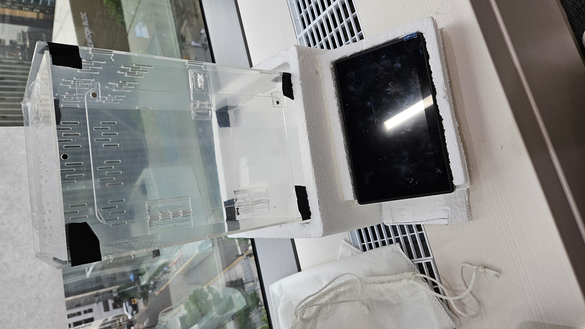

### 23.07.17
1. 우리는 지라 컨벤션과 깃 컨벤션에 대해 한번 더 이야기를 하고 지라 스프린트에일주일 치 스토리 이슈를 만들었다.
2. 임베디드 키트를 테스트하는 시간을 가졌다. 붕량 장비는 총 3개 led 1개, 적외선 리모콘 8번, 와이파이 모듈이 고장 났다.

### 23.07.18
1. 라즈베리파이에 openCV 라이브러리를 설치하였다. 설치와 각족 설정 등 대략 4시간이 걸렸다.
2. 라즈베리파이에 Flask 라이브러리를 설치하고 카메라 영상을 라즈베리파이 서버에 스트리밍 하는 간단한 코드를 작성하였다.

### 23.07.19
1. 서보모터 진동 문제를 해결하기 위해 새로운 라이브러리를 찾아서 테스트 하고 서보모터 각도 제어 함수를 구현하였다.
2. mqtt 라이브러리를 설치하고 통신 테스트를 하였다.

### 23.07.20
1. 서보 모터 브라켓을 조립하고 서버모터를 장착하였지만 어제 테스트에서 발생한 코드가 동작하지 않는 문제가 발생함
2. 알고보니 서보모터가 다른 모델이어서 발생한 현상임. 오류가 발생할 때는 소프트웨어 뿐만이 아니라 하드웨어도 확인하는 습관을 들이자(3시간 30분 날림)

### 23.07.25
1. QT 프레임 워크를 활용해 키오스크 디자인 설계를 했다.
2. QT 프레임 워크를 활용하여 디자인에 관한 base 코드를 작성했다.

### 23.07.26
1. 파충류 케이지 설계를 했다.
2. 파충류 케이지 스티로폼 가공을 했다.

    

