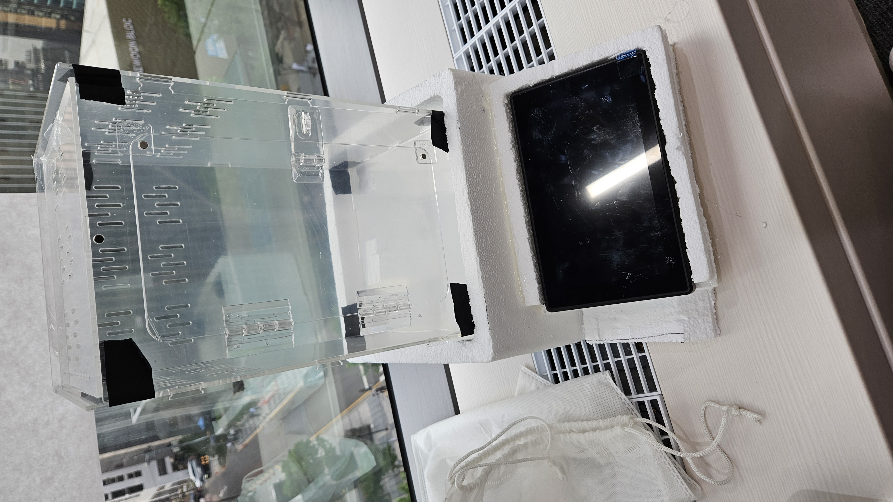

## 7/17 

### 1. IoT 지라 컨벤션
---

EPIC : 기능

Story : 세부 기능

### 2. 키트 불량 테스트
---

아두이노와 라즈베리파이 밎 각종 모듈의 불량 테스트 진행.

결과 : LED 1개, 적외선 리모콘 8번 스위치, WIFI모듈 불량

## 7/18

### 1. wifi 모듈 테스트
---
- 과정 : ESP 01 모듈 펌웨어 업데이트 -> 통신 테스트
- 결과 : 정환이 노트북에서 될때도 안될때도 있음, 내 노트북에서 안됨

### 2. 필요 라이브러리 설치 및 IDE 설치
---
- 아두이노 IDE(2.1.1)
- mqtt client 라이브러리
- dht11 라이브러리

### 3. 사용 예정 모듈 테스트 코드 작성
---
- 가습기 모듈
- 온열 패드
- 쿨링팬
- 워터 펌프 모터

### 4. mqtt 통신 스켈레톤 코드 작성
---
- ESP 기반 통신 코드 작성(테스트 예정)

## 7/19

### 1. 사용 예정 모듈 동작 테스트
### 2. mqtt 통신 json 형식으로 주고받기 테스트 코드 작성

## 7/20

### 1. CPU용 쿨링팬 동작 테스트
---
- CPU용 쿨링팬 : 4핀(GND, 12V, PWM, ..) 
- 동작을 위해 12V, 0.3A 이상 필요
- 릴레이 모듈을 사용해 동작

### 2. ESP32 의 mqtt통신 테스트
---
- sub, pub 양방향, 동시 통신 확인
- 문제점 : 일반 문자열 형태로의 데이터 전송은 가능하지만 JSON형식으로 바꿔서 보내는 것 시도시 연결 오류 발생

-> 아직 해결중

## 7/21

### 1. MQTT JSON 형식으로 통신

### 2. 전체 모듈 동시 동작 테스트

## 7/24

### 1. header 코드 작성
### 2. mqtt 헤더 파일로 작성

## 7/25
---
### 1. QT 디자인 설계
### 2. QT 디자인 코드 작성

## 7/26
---
### 1. 받침대 설계
### 2. 받침대 구현

     

